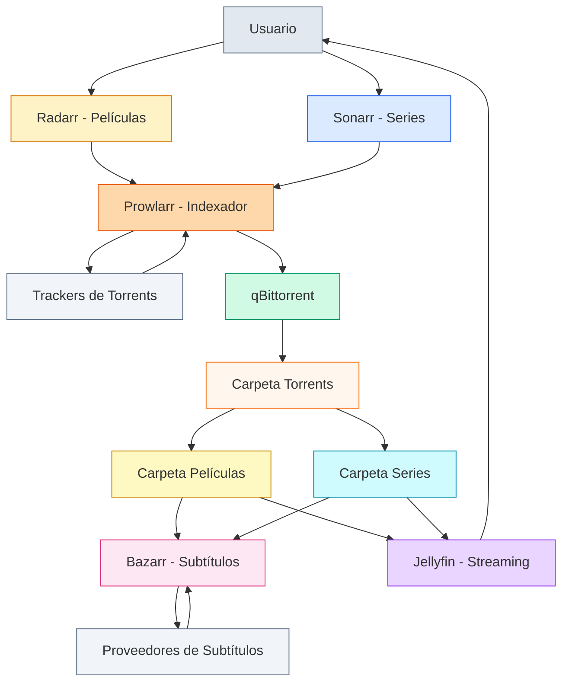

# HomeServer - Servidor Multimedia Automatizado

Stack completo de automatización de medios con gestión de películas, series, torrents y subtítulos automáticos.

## Requisitos Previos

- **Docker** y **Docker Compose** instalados
  - [Docker Desktop para Windows/Mac](https://www.docker.com/products/docker-desktop/)
  - [Docker para Linux](https://docs.docker.com/engine/install/)
- **8-16GB RAM** recomendado (ajustable en `.env`)
- **Espacio en disco:** Mínimo 100GB, recomendado 500GB+

## Configuración Inicial

### 1. Clonar y Configurar Variables de Entorno

```bash
# Clonar el repositorio
git clone https://github.com/TU_USUARIO/HomeServer.git
cd HomeServer

# Crear tu archivo .env desde el ejemplo
cp .env.example .env
```

### 2. Configurar Variables de Entorno por Sistema Operativo

Abre el archivo `.env` en tu editor de texto y ajusta los siguientes valores:

#### **macOS**

```bash
# Obtener PUID y PGID
id -u  # Normalmente: 501
id -g  # Normalmente: 20

# Obtener IP local (para acceso desde otros dispositivos)
ifconfig | grep "inet " | grep -v 127.0.0.1
# Ejemplo: 192.168.1.100
```

Configuración en `.env`:
```env
PUID=501
PGID=20
TZ=America/New_York
JELLYFIN_PUBLISHED_URL=http://192.168.1.100:8096
```

#### **Linux**

```bash
# Obtener PUID y PGID
id -u  # Normalmente: 1000
id -g  # Normalmente: 1000

# Obtener IP local
ip addr show | grep "inet " | grep -v 127.0.0.1
# o
hostname -I
```

Configuración en `.env`:
```env
PUID=1000
PGID=1000
TZ=America/New_York
JELLYFIN_PUBLISHED_URL=http://192.168.1.100:8096
```

#### **Windows (con WSL2)**

```powershell
# En PowerShell - Obtener IP local
ipconfig
# Busca "IPv4 Address" en tu adaptador de red activo
# Ejemplo: 192.168.1.100
```

Configuración en `.env`:
```env
PUID=1000
PGID=1000
TZ=America/New_York
JELLYFIN_PUBLISHED_URL=http://192.168.1.100:8096
```

**Nota Windows:** Si usas Docker Desktop con WSL2, usa `PUID=1000` y `PGID=1000`

#### **Zona Horaria**

Cambia `TZ` a tu zona horaria. [Lista completa de zonas horarias](https://en.wikipedia.org/wiki/List_of_tz_database_time_zones)

Ejemplos:
- `America/New_York` (EST)
- `America/Los_Angeles` (PST)
- `America/Chicago` (CST)
- `America/Mexico_City`
- `Europe/London`
- `Europe/Madrid`
- `Asia/Tokyo`

### 3. Levantar los Servicios

```bash
# Levantar todos los contenedores
docker compose up -d

# Ver los logs para confirmar que todo inició correctamente
docker compose logs -f

# Verificar que todos los servicios estén corriendo
docker compose ps
```

Espera 1-2 minutos para que todos los servicios inicien completamente.

## Arquitectura del Sistema



## Comandos Rápidos

```bash
# Levantar todos los servicios
docker compose up -d

# Ver logs
docker compose logs -f

# Verificar estado
docker compose ps

# Detener servicios
docker compose down

# Reiniciar un servicio específico
docker compose restart jellyfin
```

## Acceso a Servicios

| Servicio | URL | Propósito |
|----------|-----|-----------|
| **Jellyfin** | http://localhost:8096 | Servidor de streaming |
| **Radarr** | http://localhost:7878 | Gestor de películas |
| **Sonarr** | http://localhost:8989 | Gestor de series |
| **Prowlarr** | http://localhost:9696 | Indexador de torrents |
| **qBittorrent** | http://localhost:8080 | Cliente torrent |
| **Bazarr** | http://localhost:6767 | Gestor de subtítulos |

## Estructura del Proyecto

```
HomeServer/
├── docker-compose.yml
├── .env
├── config/              # Configuraciones persistentes
│   ├── jellyfin/
│   ├── radarr/
│   ├── sonarr/
│   ├── prowlarr/
│   ├── qbittorrent/
│   └── bazarr/
└── data/                # Archivos multimedia
    ├── torrents/        # Descargas temporales
    └── media/           # Biblioteca final
        ├── movies/
        └── shows/
```

Estas carpetas se crean automáticamente al levantar los contenedores.

## Uso de Recursos

**Memoria (con configuración por defecto):**
- Jellyfin: 4GB máx / 2GB reservado
- qBittorrent: 2GB máx / 1GB reservado
- Radarr: 1GB máx / 512MB reservado
- Sonarr: 1GB máx / 512MB reservado
- Prowlarr: 512MB máx / 256MB reservado
- Bazarr: 512MB máx / 256MB reservado

**Total aprox:** 9GB máximo cuando todos están activos

## Configuración de Servicios (Paso a Paso)

Una vez que todos los contenedores estén corriendo, configura cada servicio en el siguiente orden:

### Prowlarr - Indexador de Torrents

**URL:** http://localhost:9696

#### Configuración Inicial:
1. **Primera vez:** Completar el wizard de bienvenida
2. **Agregar Indexadores:**
   - Ir a `Indexers` → `Add Indexer`
   - Busca y agrega indexadores públicos populares:
     - **1337x** (público)
     - **The Pirate Bay** (público)
     - **RARBG** (público)
     - Otros según tu región
   - Para cada uno, simplemente haz clic en ellos y luego `Save`

3. **Conectar con Radarr y Sonarr:**
   - Ir a `Settings` → `Apps` → `Add Application`
   
   **Para Radarr:**
   - Application: `Radarr`
   - Prowlarr Server: `http://localhost:9696`
   - Radarr Server: `http://radarr:7878`
   - API Key: (ve a Radarr → Settings → General → copia el API Key)
   - Sync Level: `Full Sync`
   - Haz clic en `Test` y luego `Save`
   
   **Para Sonarr:**
   - Application: `Sonarr`
   - Prowlarr Server: `http://localhost:9696`
   - Sonarr Server: `http://sonarr:8989`
   - API Key: (ve a Sonarr → Settings → General → copia el API Key)
   - Sync Level: `Full Sync`
   - Haz clic en `Test` y luego `Save`

### qBittorrent - Cliente de Descargas

**URL:** http://localhost:8080

#### Credenciales Iniciales:
- **Usuario:** `admin`
- **Contraseña:** `adminadmin`

#### Configuración:
1. **Cambiar contraseña inmediatamente:**
   - `Tools` → `Options` → `Web UI`
   - Cambia la contraseña en `Authentication`

2. **Configurar rutas de descarga:**
   - `Tools` → `Options` → `Downloads`
   - **Default Save Path:** `/data/torrents`
   - **Keep incomplete torrents in:** `/data/torrents/incomplete` (opcional)
   - Guarda los cambios

3. **Configuración opcional recomendada:**
   - `BitTorrent` → Habilita `Anonymous Mode`
   - `Speed` → Ajusta límites si es necesario

### Radarr - Gestor de Películas

**URL:** http://localhost:7878

#### Configuración:
1. **Completar wizard inicial** si es primera vez

2. **Configurar carpeta de medios:**
   - `Settings` → `Media Management`
   - Habilitar `Show Advanced` (arriba a la derecha)
   - Habilitar `Rename Movies`
   - Habilitar `Replace Illegal Characters`
   - `Add Root Folder`: `/data/media/movies`
   - Guarda cambios

3. **Agregar cliente de descarga (qBittorrent):**
   - `Settings` → `Download Clients` → `+` (Add)
   - Selecciona `qBittorrent`
   - **Name:** `qBittorrent`
   - **Host:** `qbittorrent`
   - **Port:** `8080`
   - **Username:** `admin`
   - **Password:** (la que configuraste)
   - **Category:** `movies`
   - Haz clic en `Test` y luego `Save`

4. **Configuración de calidad (opcional):**
   - `Settings` → `Profiles`
   - Ajusta según tus preferencias (1080p, 4K, etc.)

### Sonarr - Gestor de Series

**URL:** http://localhost:8989

#### Configuración:
1. **Completar wizard inicial** si es primera vez

2. **Configurar carpeta de medios:**
   - `Settings` → `Media Management`
   - Habilitar `Show Advanced` (arriba a la derecha)
   - Habilitar `Rename Episodes`
   - Habilitar `Replace Illegal Characters`
   - `Add Root Folder`: `/data/media/shows`
   - **Episode Naming:** Ajustar formato si deseas
   - Guarda cambios

3. **Agregar cliente de descarga (qBittorrent):**
   - `Settings` → `Download Clients` → `+` (Add)
   - Selecciona `qBittorrent`
   - **Name:** `qBittorrent`
   - **Host:** `qbittorrent`
   - **Port:** `8080`
   - **Username:** `admin`
   - **Password:** (la que configuraste)
   - **Category:** `shows`
   - Haz clic en `Test` y luego `Save`

4. **Configuración de calidad (opcional):**
   - `Settings` → `Profiles`
   - Ajusta según tus preferencias

### Bazarr - Gestor de Subtítulos

**URL:** http://localhost:6767

#### Configuración:
1. **Conectar con Sonarr:**
   - `Settings` → `Sonarr`
   - Habilitar `Use Sonarr`
   - **Address:** `sonarr` (sin http://)
   - **Port:** `8989`
   - **Base URL:** (dejar vacío)
   - **API Key:** (copia desde Sonarr → Settings → General)
   - **Path Mappings:**
     - Sonarr path: `/data/media/shows`
     - Bazarr path: `/data/media/shows`
   - Haz clic en `Test` y luego `Save`

2. **Conectar con Radarr:**
   - `Settings` → `Radarr`
   - Habilitar `Use Radarr`
   - **Address:** `radarr` (sin http://)
   - **Port:** `7878`
   - **Base URL:** (dejar vacío)
   - **API Key:** (copia desde Radarr → Settings → General)
   - **Path Mappings:**
     - Radarr path: `/data/media/movies`
     - Bazarr path: `/data/media/movies`
   - Haz clic en `Test` y luego `Save`

3. **Configurar idiomas:**
   - `Settings` → `Languages`
   - **Languages Filter:** Selecciona los idiomas que quieres
     - Ejemplo: `Spanish`, `English`
   - **Default Settings:**
     - Series: Selecciona idiomas deseados
     - Movies: Selecciona idiomas deseados
   - Guarda cambios

4. **Agregar proveedores de subtítulos:**
   - `Settings` → `Providers`
   - Habilita y configura proveedores:
     - **OpenSubtitles:** (requiere cuenta gratuita)
     - **Subdivx:** (español, no requiere cuenta)
     - **Subscene:** (no requiere cuenta)
     - Otros según preferencia
   - Para OpenSubtitles:
     - Crea cuenta en https://www.opensubtitles.com
     - Ingresa username y password
   - Guarda cambios

### Jellyfin - Servidor de Streaming

**URL:** http://localhost:8096

#### Configuración Inicial:
1. **Wizard de bienvenida:**
   - Selecciona tu idioma preferido
   - Crea tu usuario administrador

2. **Agregar bibliotecas:**
   
   **Biblioteca de Películas:**
   - Haz clic en `Add Media Library`
   - **Content type:** `Movies`
   - **Display name:** `Películas` (o el nombre que prefieras)
   - **Folders:** Haz clic en `+` y agrega `/data/media/movies`
   - Configuración recomendada:
     - Habilitar `Enable real time monitoring`
     - Seleccionar idioma de metadata
   - Guarda

   **Biblioteca de Series:**
   - Haz clic en `Add Media Library`
   - **Content type:** `Shows`
   - **Display name:** `Series` (o el nombre que prefieras)
   - **Folders:** Haz clic en `+` y agrega `/data/media/shows`
   - Configuración recomendada:
     - Habilitar `Enable real time monitoring`
     - Seleccionar idioma de metadata
   - Guarda

3. **Configuración adicional:**
   - `Dashboard` → `Playback`
   - Configura transcoding según las capacidades de tu hardware
   - Para Mac M2: Puedes usar hardware acceleration si está disponible

4. **Finalizar:**
   - Completa el wizard
   - ¡Listo! Ya puedes empezar a usar Jellyfin

---

## Flujo de Uso

Una vez configurado todo:

1. **Agregar contenido:**
   - Ve a Radarr o Sonarr
   - Busca películas o series
   - Agrega a tu biblioteca

2. **Descarga automática:**
   - Radarr/Sonarr buscarán en Prowlarr
   - Enviarán el torrent a qBittorrent
   - qBittorrent descargará el archivo

3. **Organización automática:**
   - Una vez completada la descarga
   - Radarr/Sonarr moverán y renombrarán el archivo
   - Lo colocarán en `/data/media/movies` o `/data/media/shows`

4. **Subtítulos automáticos:**
   - Bazarr detectará el nuevo contenido
   - Buscará y descargará subtítulos
   - Los agregará junto al archivo de video

5. **Reproducir:**
   - Abre Jellyfin
   - El contenido aparecerá automáticamente en tu biblioteca
   - ¡A disfrutar!

## Acceso desde Otros Dispositivos

### En la Misma Red Local

Si configuraste `JELLYFIN_PUBLISHED_URL` con tu IP local en el `.env`, puedes acceder a Jellyfin desde cualquier dispositivo en tu red:

**Ejemplo:** `http://192.168.1.100:8096`

Todos los demás servicios también son accesibles:
- Radarr: `http://TU_IP:7878`
- Sonarr: `http://TU_IP:8989`
- Prowlarr: `http://TU_IP:9696`
- qBittorrent: `http://TU_IP:8080`
- Bazarr: `http://TU_IP:6767`

### Desde Internet con HTTPS (Caddy)

Para acceso seguro desde fuera de tu red usando SSL/HTTPS:

#### Requisitos Previos:
- Un dominio (gratuito con [No-IP](https://www.noip.com) o similar)
- Puertos 80 y 443 redirigidos a tu servidor en el router

#### Configuración:

1. **Crear el Caddyfile:**
   ```bash
   mkdir -p config/caddy
   cp Caddyfile.example config/caddy/Caddyfile
   
   # Editar con tu dominio
   nano config/caddy/Caddyfile
   ```
   
   Contenido:
   ```caddyfile
   tu-dominio.ddns.net {
       reverse_proxy jellyfin:8096
   }
   ```

2. **Actualizar `.env`:**
   ```env
   JELLYFIN_PUBLISHED_URL=https://tu-dominio.ddns.net
   ```

3. **Levantar servicios:**
   ```bash
   docker compose up -d
   
   # Verificar que Caddy obtuvo el certificado
   docker compose logs caddy
   ```

4. **Acceder:** `https://tu-dominio.ddns.net`

> **Nota:** Caddy obtiene y renueva certificados Let's Encrypt automáticamente. No necesitas cron jobs.

#### Alternativa: VPN (Más Seguro)
- [Tailscale](https://tailscale.com) - Fácil de configurar
- WireGuard - Mayor control

## Migración a Disco Externo

Cuando necesites más espacio o quieras usar un disco externo:

### macOS
```bash
docker compose down
mv ./data /Volumes/MiDiscoExterno/
mv ./config /Volumes/MiDiscoExterno/
```

Edita `.env`:
```env
DATA_PATH=/Volumes/MiDiscoExterno/data
CONFIG_PATH=/Volumes/MiDiscoExterno/config
```

```bash
docker compose up -d
```

### Linux
```bash
docker compose down
mv ./data /mnt/disco/
mv ./config /mnt/disco/
```

Edita `.env`:
```env
DATA_PATH=/mnt/disco/data
CONFIG_PATH=/mnt/disco/config
```

```bash
docker compose up -d
```

### Windows
```powershell
docker compose down
move data D:\HomeServer\data
move config D:\HomeServer\config
```

Edita `.env`:
```env
DATA_PATH=D:/HomeServer/data
CONFIG_PATH=D:/HomeServer/config
```

```powershell
docker compose up -d
```

## Comandos Útiles

```bash
# Ver logs de un servicio específico
docker compose logs -f jellyfin

# Ver logs de todos los servicios
docker compose logs -f

# Reiniciar un servicio
docker compose restart radarr

# Reiniciar todos los servicios
docker compose restart

# Detener todos los servicios
docker compose down

# Actualizar imágenes a última versión
docker compose pull
docker compose up -d

# Limpiar contenedores e imágenes antiguas
docker system prune -a

# Verificar uso de recursos en tiempo real
docker stats

# Ver estado de los contenedores
docker compose ps
```

## Mantenimiento

### Backups Recomendados

Las carpetas importantes para hacer backup:
- `config/` - Contiene todas las configuraciones, API keys, bases de datos
- `data/media/` - Tu biblioteca de películas y series (opcional si puedes redescargar)

```bash
# Ejemplo de backup simple
tar -czf backup-config-$(date +%Y%m%d).tar.gz config/
```

### Actualizaciones

Las imágenes usan la etiqueta `:latest`, lo que significa que siempre obtendrás la versión más reciente:

```bash
# Detener servicios
docker compose down

# Descargar nuevas versiones
docker compose pull

# Levantar con nuevas versiones
docker compose up -d

# Verificar logs por si hay errores
docker compose logs -f
```
